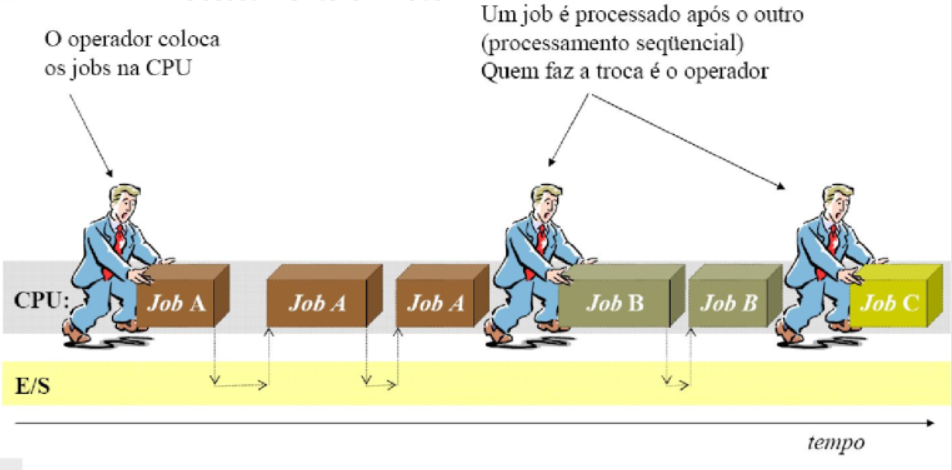
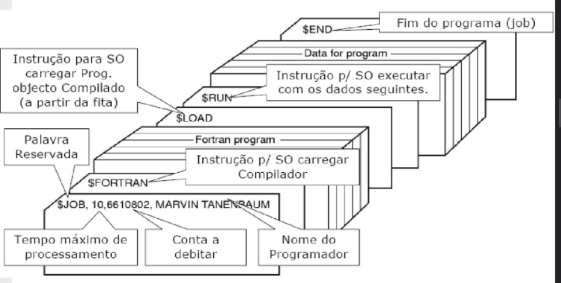
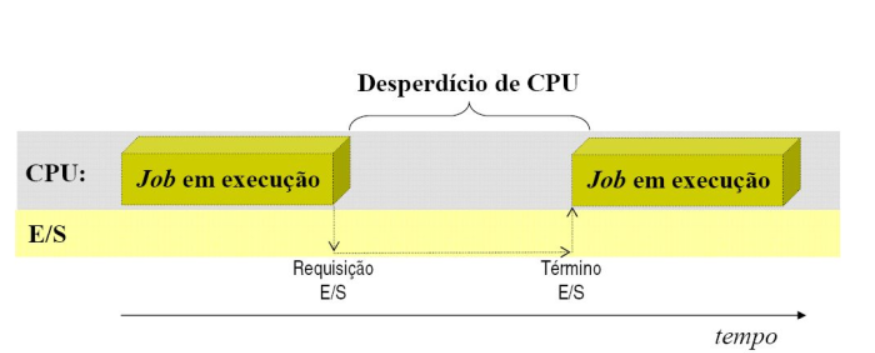

<!-- CENTRALIZADO -->

<h1 class="centralizado">Evolução Histórica dos Sistemas Operacionais</h1>

 
# Evolução Histórica dos Sistemas Operacionais

> - A história dos SO está ligada à evolução da arquitetura dos computadores
>- SO e arquitetura de computadores influenciaram-se mutuamente
>- O surgimento de novas facilidades de HW permitiu a sofisticação dos recursos oferecidos pelo SO

1. **PRIMEIRA FASE (1945-1955)** - Válvulas e painéis de conexão
2. **SEGUNDA FASE (1956-1965)** - Transistores e lote
3. **TERCEIRA FASE (1966-1980)** - CI e Multiprogramação
4. **QUARTA FASE (1981 - Atualmente)** - Computadores pessoais

## Primeira fase (1945-1955)

Com o início da II guerra mundial surgem os primeiros computadores

    Milhares de válvulas, necessidades de grandes áreas, alto consumo,
    funcionamento lento e pouco confiável

&rarr; ENINAC (1º computador de propósito geral)

- Para trabalhar no ENIAC era necessário conhecer profundamente o funcionamento
  do HW
- A programação era feiita em painéis, por meio de cabos, e em linguagem de
  máquina
- Existia um grupo de pessoas que projetava, consntruía, porgramava, operava e
  realizava a manutenção desses computadores
- Nessa fase não existia o conceito de SO e nem de linguagem de programação

## Segunda fase

- A criação do **transistor** e das **memórias magnéticas**
contribui para o o avanço dos computadores da época

    - transistor &rarr; menor em tamanho e consumo, além de mais veloz, confiável e resistente
    - memórias magnéticas &rarr; acesso mais rápido aos dados, maior capacidade de
  armazenamento e computadores menores

&rarr; Surgem os MainFrame (computadores de grande porte)

    1. Grande computador
    2. Sem interação com o usuário
    3. Fila de tarefas (jobs)
    4. Periféricos lentos
    5. CPU ociosa
    6. Processamentno puramente sequencial (um job após o outro)
    7. Sequenciamento manual (o operador passa de um job para outro)
    8. Usuário não interage com o hardware

> os MainFrame possuiam um custo alto e dele surgiu a ideia de linguagem de
> programação (Fortran e Cobol)

- E/S dos MainFrames era lenta &rarr; Computador ocioso
    - Os programas eram codificados nos cartões (trabalhoso)
    - surgem os operadores de máquina

| OPERAÇÃO COM CARTÃO |
|:-:|
| Cada programa (*job*) ou conjunto de programas é escrito e perfurado por um programador, depois era entregue ao operador da máquina para que o mesmo fosse processado |

    Exemplo de execução de um programa FORTRAN

    1. Carrega fita magnétiica com o compilador
    2. Compilador lê o programa de cartões, e gera programa *assembler* em cartão
    3. Carrega fita com o montador
    4. Montador lê o programa *assembler* e gera código de máquina em cartão, sem as
       rotinas da biblioteca
    5. Carrega fita com o ligador (*linker*) 
    6. Ligador lê o códifo de máquina de cartão e liga com as rotinas da biblioteca,
       gerando o código exe
    7. carrega exe e executa programa

Naquela época, a interação era física e manual. Para o seu código FORTRAN virar um programa executável (EXE), um operador humano precisava:

1. Colocar a fita magnética do Compilador na máquina para ler o seu código;
2. Pegar o resultado (que saía em novos cartões de papel) e colocar a fita do Montador (Assembler);
3. Pegar mais cartões perfurados que saíam da máquina e trocar pela fita do Ligador (Linker) para juntar as bibliotecas;

Só depois de todo esse malabarismo físico, o programa (EXE) estava pronto para ser executado.

### Problema

Enquanto o humano ficava tirando e colocando fitas e cartões na máquina, a CPU
ficava totalmente parada e ociosa.

Grande tempo de preparação para colocar e retirar fitas e colocar e tirar
cartões &rarr; **A CPU ficava parada durante a preparação**

### Solução

Foi exatamente para resolver esse desperdício de tempo que inventaram o
Processamento em Lotes (Batch), agrupando tarefas que usavam o mesmo compilador
para minimizar a troca de fitas

- Lotes (batches) para minimizar a ociosidade da CPU
    - Jobs com necessidades similares eram reunidos para minnimizar as trocas de
      fitas

#### Processamento em Lote

A ideia do Lote era econnomizar tempo de preparação, mesmo assim quando um job
parava, o operador teria que:

1. determinar porque o programa parou (término normal ou anormal)
2. listar connteúdos de memória se necessário
3. Inicializar o computador novamente

Durante a transição entre os jobs, novamente a CPU ficava ociosa. Para resolver
isso foi desenvolvido um **sequenciador automático** de jobs.

- 1º SO rudimentar
- Controlar a transferência automática de um job para outro (reduzia o tempo
  desperdiçado entre 2 jobs do mesmo lote)
- Este programa foii implementado sob a forma de um monintor resiidente, sempre
  presente na memória da máquina para esse fim

&rarr; Monitor Residente

- Problemas:
    - Como saber qual programa executar?
    - como o monintor sistingue uma tarefa de outra tarefa e dados e programa?
- Solução:
    - introduzir cartões de controle

Um avanço foi a operação humana ser substituída pelo monitor residente. Contudo,
a CPU passava a maior parte do tempo esperando por E/S (dispositivos mecânicos)

A Cpu ficava ociosa esperando o dispositivo de E/S terminar o processo

##### Técnicas para Minimizar o Problema de E/S do Processamento em Lote

- Operação off-line
- Bufferização
- Spooling

| off-line | bufferização | spooling |
|:--:|:--:|:--:|
| Um computadr satélite lia cartões e gravava suas imagens em fita magnética. O computador principal trabalhava apenas com fitas mangéticas &rarr; Os dados eram lidos de fitas magnéticas (não de cartões) e resultados eram escritos em fitas magnéticas (não em impressoras), pois estas unidades eram bem mais rápidas que leituras de cartão e impressoras. Os resultados das execuções (gravados em fita) eram descarregados na impressora por outro computador satélite. **Processamento em lote do tipo offline permite a sobreposição de operações de CPU e E/S pela execução dessas duas ações em duas máquinas independentes. Para atingir tal sobreposição em uma única máquina, uma arquitetura adequada deve ser desenvolvida para permitir a técnica de buferização.** | Enquanto o sistema ficava lendo/escrevendo as innformações da/na fita, a CPU ficava esperando. A bufferização faz com que uma E/S seja transferida para um buffer. Enquanto a CPU processa o connteúdo do buffer, o dispositivo podia realizar outra E/S no mesmo instante. &rarr; buffer = região de MP temporária para escrita e leitura dos dados. &rarr; Operação de E/S acontece em paralelo com a computação. Para que os dispositivos de E/S continue sempre trabalhando os buffers tinham que ter tamanho suficiente para mantê-lo sempre ocupado. **Apesar da buferização ajudar, ela raramente é suficiente para manter a CPU sempre ocupada, já que os buffers eram pequenos e os disspositivos de E/S costumam ser muito lentos em relação à CPU. 

