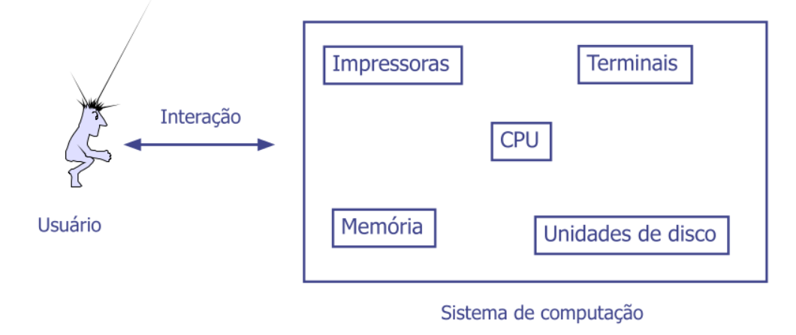
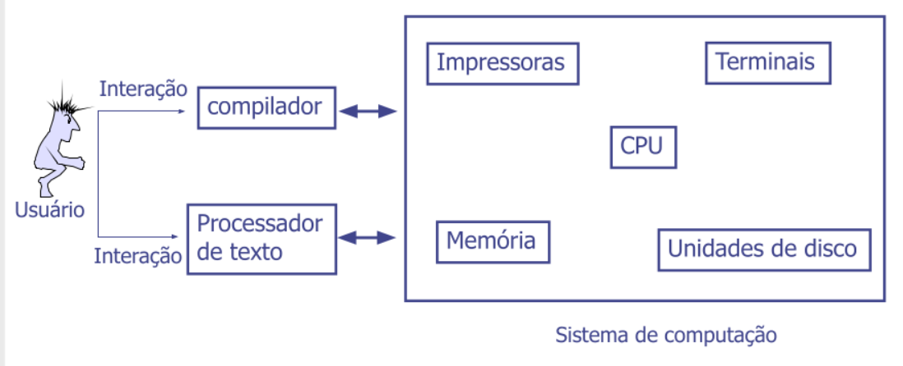
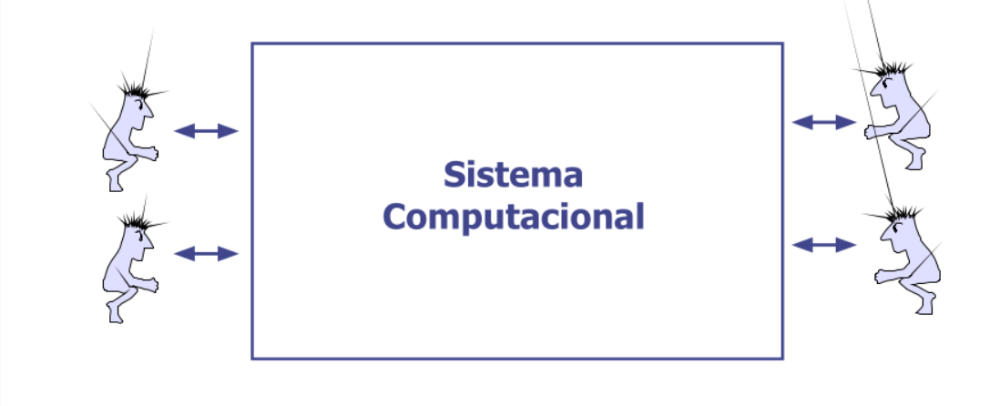

<h1 class="centralizado">Introdução aos Sistemas Operacionais</h1>

# Sistema Operacional - Motivação

## Problemas

&rarr; Conjunto de instruções, organizações de memória, I/O, barramento em nível
de linguagem de máquina é complicado para se programar

&rarr; Operações mais básicas _read_ e _write_: 13 parametros empacotados em 9
bytes [^1]

[^1]: Sem um sistema operacional seria necessário fornecer 13 parametros
    diferentes só para ler ou gravar um dado, e além disso precisaria manipular
    os bits para que coubessem dentro de um espaço de 9 bytes

&rarr; O programador teria que se preocupar até se o motor do disco está ligado
ou desligado

&rarr; Comandos para ler e escrever dados, mover o braço do disco, formatar
trilhas, resetar, inicializar, calibrar o controlador e os drivers

&rarr; Dependência da arquitetura do computador

# O que é um Sistema Operacional

&rarr; Programa que permite as pessoas utilizarem o hardware/recursos
disponíveis no computador

&rarr; Iterface entre o usuário/aplicação e dispositivos de hardware disponíveis

&rarr; Programa especial que controla e coordena todas as operações básicas de
um sistema de computação

&rarr; software que oferece uma interface para o usuário se comunicar com o
computador

## definição

O sistema operacional é um conjunto de rotinas que são executadas pelo
processador para **facilitar** o acesso aos componentes de hardware (processador,
memória, dispositivo de E/S), e **gerenciar** o uso do sistema de computação
(hardware e software)

Tradicionalmente os S.O eram escritos em linguagem **Assembly**. Já faz um certo
tempo que a maioria dos S.O são escritos em linguagens de alto nível

> Exemplos: DOS, MAcintosh, Windows, Unix

## Objetivos

&rarr; Tornar ao usuário a utilização do computador mais conveniente

    1. Esconde detalhes internos
    2. Reduz o tempo necessário a construção de programas

&rarr; Utilizar o hardware do computador de forma eficiente

    1. Obtida por uma melhor distribuição/uso dos recursos
    2. Aproveitar os recursos da melhor forma, não os subutilizando e/ou
       deixando-os ociosos

&rarr; Coordenar os dispositivos de um sistema computacional em prol de algum
objetivo "alto nível" dos usuários e/ou aplicações

&rarr; disponibilizar uma interface de serviços para as aplicações e/ou usuários

    1. Esta itnerface seria mais "alto nível" do que aquelas disponibilizadas
       pelos recursos de hardware em si

       1.1 Escondendo detalhes internos dos mesmos
       1.2 Reduzinndo o tempo necessário a consntrução de programas 

## por que um Sistema Operacional é importante?

&rarr; Facilitam o uso do equipamento para usuários finais

&rarr; Utilizam os recursos de hardware de forma eficiente

&rarr; Administram diferentes periféricos de diferentes fabricantes de forma
transparente

&rarr; Realizam o controle de acesso

&rarr; Define que programas podem ser utilizados, sendo esta informação básica
para a escolha do sistema adequado à corporação ou ao uso pessoal

&rarr; os usuários costumam, por necessidade, *conhecer* mais o Sistema
Operacional que o próprio hardware do equipamento que utilizam

# Visão do Sistema Operacional

&rarr; Localização

    1. Residente no disco rígido do computador (na maioria dos casos)
    2. Possibilidade de armazeamento em um chip ROM (handhelds)

&rarr; Computadores de diferentes portes possuem tipicamente diferentes sistemas
operacionais

&rarr; Tipos similares de computadores podem possuir sistemas operacionais
diferentes

&rarr; Diversos sistemas operacionais não são compatíveis entre si

# Composição básica de um Sistema Operacional

&rarr; Um sistema operacionnal consiste basicamente, de um **núcleo** (Kernel) e alguns **programas do sistema**. Há ainda aplicações queu executam diversas tarefas.

&rarr; O núcleo é o coração do sistema operacional, contendo rotinas mais
críticas e mais utilizadas. Sempre a última etapa de atendimento do comando de
um usuário é realizada pelo núcleo.

&rarr; Núcleo de um SO

    1. Gestão de memória e dispositivos
    2. Gestão de arquivos e processos
    3. Inicialização de aplicativos
    4. Compartilhametno de recursos computacionais (programas, dispositivos, dados, informação)

&rarr; A cada inicialização do computador, o kernel e outras instruções de uso
frequente do SO são carregadas

> O kernel é residente na memória. Permanece na memória enquanto o computador
> estiver executando.

# Funções do SO

&rarr; Atua como **MÁQUINA VIRTUAL**, estendendo a máquina

    1. Apresentar ao usuário o esquivalente a uma máquina estendida ou máquina
       virtual que é mais fácil de porgramar e usar do que o hardware subjacente

&rarr; SO como uma máquina virtual:

- Problema:
    - O HW é difícil de programar
    - A maioria dos programadores não "pode" programar em baixo nível

- Solução
    - Prover uma abstração de alto nível do HW para os programadores
    - EX: Discos de coleção de arquivos identificados por nomes. Cada arquivo
      pode ser: 1) aberto, 2) lido, 3) escrito ou 4)fechado
    - Detalhes sobre os processos acima ou sobre o estado concorrente do motor
      da controladora, não devem aparecer na abstração do usuário

- Então...
    - O SO é o SW que esconde os detalhes de baixo nível do usuário e
      apresenta-lhe um esquema simples e agradável
    - O SO isola o usuário dos detalhes de várias operações de baixo nível
      (interrupções, temporizadores, gerenciamento de memória e CPU, entre
      outras) e em cada caso, a abstração apresentada ao ususário do SO é mais
      simples e mais fácil de utilizar que o próprio HW.

- Assim...
    - O SO torna a interação entre usuários e computador mais simples, confiável
      e eficiente
    - O SO elimina a necessidade do programador se envolver com a complexidade do
      HW
    - O SO faz o HW tornnar-se transparente para o usuário

- Dessa forma...
    - Uma das funções do SO é a de apresentar ao usuário uma máquina virtual
      equivalente ao HW, porém muito mais simples de programar

&rarr; Atua como **GERENCIADOR DE RECURSOS** 

    1. Fornece uma variedade de serviços que programas podem obter usando
       intruções especiais chamadas *system calls* (ou chamadas ao sistema operacional)

&rarr; O SO como um Gerenciador de recursos

- O conceito de SO como fornecedor de ua interface conveniente a seus usuários é
  uma visão *top-down*

- Uma visão alternativa, *bottom-up**, mostra o SO como um gerente de recursos
  de HW disponíveis na máquina
    - Nessa visão, a função do SO é a de fornecer um esquema de compartilhametno
      de CPU, memórias e dispositivos de E/S entre os processos que
      competem/concorrem pelo uso de tais recursos.

> Por exemplo, o que poderia acontecer se 3 processos resolvessem imprimir
      simultâneamente na mesma impressora?

    1. Algumas linhas poderiam ser do processo 1, as seguintes do processo 2 e
       assim por diante, alternadamente, até que terminasse a impressão

    2. DEVE SER -> O processo 1 imprime, depois o processo 2 e por fim o processo
    3, isoladamente, onde cada um espera terminar a impressão do predecessor

- Como fazer isso?
    - O SO armazena em disco todas as saídas destinadas a impressora, durante a
      execução dos processos.
    - Quando um dos processos terminar sua execução, o SO copia sua saíidia do
      disco para a impressora, enquanto os demais continuam a executar e,
      eventualmente, a gerar saída no arquivo em disco.

- Essa visão mostra que a função de um SO é gerenciar o compartilhamento de
  recursos da máquina, garantindo o acesso concorrente, organizando e protegido
  a estes recursos.

# Serviços oferencidos pelo SO

1. Criação de programas
    - Editores, depuradores, compiladores
2. Execução de programas
    - Carga de programas em memória
3. Acesso a dispositivos de E/S
4. Controle de acesso a arquivos
5. Proteção entre usuários
6. Contabilidade
    - Estatístiicas
    - monitoração de desempenho
    - Sinalizar *upgrade* de hardware necessário
7. Detecção de erros
    - Erros de hardware
    - Faha em dispositivos de E/S
    - Overflow em operações aritméticas
    - Acesso não autorizado a posições de memória
    - Aplicação soliicita recursos que o sistema operacional não pode alocar (segurança, falta do recursos e etc)

# Funções de um Sistema Operacional

- Inicialização do computador
- Gestão de programas
- Gestão da memória
- Programação de tarefas
- Configuração de dispositivos
- Acesso à web
- Segurança do sistema
- Controle de rede
- Monintoração do desempenho
- Interfaceamento com o usuário
- Gestão de memória Virtual
- O SO aloca uma porção de um meio de armazenamentno (usualmente o dissco
  rígido) para atual como RAM adicional
- Formatação de discos
    - Processo de preparação de um disco para leitura e escrita
    - A maioria dos fabricantes de discos rígidos e disquetes pré-formatam seus
      produtos
    - Vários SO formatam discos de modo diferente
- Apoio a programas
    - Salvar arquivos em disco
    - Ler arquivos do disco para a memória
    - Verificar o espaço disponível em disco e memória
    - Alocar memória para armazenar dados e programas
    - Ler toque de teclas do teclado e exibir caracteres ou gráficos na tela
    - Os programas trazem incorporados a si instruções que solicitam ao sistema
      operacional estes serviços. Essas instruções são denominadas **chamadas ao sistema operacional**
- Ambiente multi-tarefas
    - Usuário trabalhoa ao mesmo tempo com duas ou mais aplicações residentes na
      memória
- Comunicação com dispositivos E/S
    - Driver de dispositivo: Programa que possibilita a comunincação do SO com
      um dispositivo de E/S
    - Cada dispositivo requer um driver próprio
- Plug'n Play (PNP ou Plug and Play)
    - Reconhecimento de novos dispositivos pelo computador, insntalação
      automaíca de drivers para esses dispositivos e verificação de conflitos
      com outros dispositivos
    - Suportado pela maioria dos dispositivos e SO atuais
- Interface com o usuário
    - Controle do modo de entrada de dados e do modo de apresentação das
      informações a tela do monitor
    - Do ponto de vista do usuário, o que faz ou prejudica um SO é a qualidade
      da interface com o usuário
    - Às vezes, a interface com o usuário é denominada shell, sugerindo a idéia
      de que a interface com o usuário (o shell) "envolve" o sistema
      operacionnal (o kernel dentro do shell)

- Os três tipos de interface com o usuário são:
    - Interface de linha de comando
    - Interface baseada em menus
    - Interface gráfica

## Gestão de Memória Virtual

### Passo 1

O SO transfere os dados e as intruções de programas menos usados recentemente
para o disco rígido, uma vez que a memória é necessária para outros propósitos 

### Passo 2

O SO transfere os dados e as intruções de programas do disco rígido para a
memória quando necessários

# Tipos de Sistemas Operacionais

1. Monotarefa

> Característica: Sistema simples onde o usuário executa uma tarefa por vez

2. Multitarefa (Monousuário)

> Característica: Um único usuário pode exigir que o sistema aceite executar
> mais de uma tarefa "ao mesmo tempo"

3. Multiusuário

> Característica: Permite que vários usuários compartilhem o acesso aos recursos
> do computador

&rarr; EXECUTAR TAREFAS SIMULTÂNEAS: Monotarefa, multitarefa

&rarr; SUPORTE A VÁRIAS CPUS: Mono ou Multiprocessados

&rarr; USUÁRIOS SIMULTÂNEOS: Monousuário, multiusuario

&rarr; TEMPO DE RESPOSTA: Batch, interativos, de tempo real

# Tipos de Processamento

&rarr; SO Batch ou em lote
    
    As tarefas de cários usuários são agrupadas fisicamente e processadas
    sequencialmente uma após a outra

&rarr; *timesharing* ou tempo compartilhado

    Cada processo possui um tempo determinado (time-slice ou slot) para uso da
    CPU e recursos computacionais

&rarr; SO real time ou tempo real

    Há a priorização entre processos (em detrimento de outros) para uso de
    recursos, em que o tempo de resposta dos mesmo deve corresponder à sua
    natureza

&rarr; SO para redes (mais comum)

    Cada máquina na rede tem eu próprio SO, que funciona considerando aquelas
    máquinas autônomas e visualizando apenas os recursos que cada uma dispõe

&rarr; SO distribuídos

    1. Um SO para várias máquinas que estão na rede, com os recursos de cada uma
    delas disponível para gerenciar
    2. Visão transparente por parte do usuário que o está utilizando
    3. fornece serviões como a localização dos recursos na rede (de forma
       transparente), segurança (ex: autenticação de usuários, redundância de
       arquivos, entre outros a depender da implementação do SO), concorrência

&rarr; Arquiteturas variadas que utilizam middlewares + SO para redes

---

# Questões
> As questões foram feitas com o auxílio do notebookLM alimentado com fontes das aulas da professora Tarciana

## **Questão 1:**
Os serviços e funções fornecidos por um sistema operacional podem ser compreendidos através de duas visões principais (uma visão *top-down* e uma alternativa *bottom-up*). Descreva resumidamente essas duas abordagens e justifique o problema que a visão *top-down* busca resolver para os programadores.

## **Questão 2:**
Assumindo a função do SO como um Gerenciador de Recursos, considere um cenário em que três processos distintos decidem imprimir documentos simultaneamente na mesma impressora.
O que aconteceria com o resultado da impressão se o SO não interviesse? Explique detalhadamente a estratégia que o Sistema Operacional utiliza para resolver esse problema de concorrência e garantir a impressão correta.

## **Questão 3:**
Sistemas Operacionais atuam como gerenciadores de recursos e fornecem uma variedade de serviços aos programas. Como os programas em execução conseguem solicitar e obter esses serviços específicos do SO?

## **Questão 4 (Assinale a alternativa incorreta):**
Sobre as funções e a visão geral de um Sistema Operacional, assinale a alternativa **incorreta**:

**A)** Na visão como Máquina Virtual, o SO provê uma abstração de alto nível do hardware para os programadores, pois o hardware em si é difícil de programar.

**B)** Uma abstração clássica fornecida pelo SO é esconder a complexidade dos discos, apresentando-os aos programadores como uma coleção de arquivos identificados por nomes que podem ser lidos e escritos.

**C)** A visão alternativa (*bottom-up*) mostra o SO puramente como um aplicativo de usuário responsável por compilar códigos-fonte em linguagem de máquina, sem envolvimento com o hardware.

**D)** Na visão de gerenciador de recursos, a função do SO é fornecer um esquema de compartilhamento ordenado de CPU, memórias e dispositivos de E/S entre os processos que competem por eles.

<!-- ================================================ -->

<!-- CENTRALIZADO -->

<!-- CENTRALIZADO AZUL -->

<!-- AZUL -->

