# Gerenciamento de memória

## Conceitos chave

### Endereçamento e MMU
A CPU sempre gera endereços lógicos (virtuais), enquanto a RAM trabalha apenas com endereços físicos. A MMU (Memory Management Unit) é o hardware responsável por traduzir esses endereços em tempo real.

### Otimização de Espaço
Para economizar memória, o Link Dinâmico adia o carregamento de bibliotecas até o tempo de execução. O Overlay é uma ténica onde o programa mantém na RAM apenas as instruções e dados estritamente necessários no momento, mas exige que o programador implemente a lógica manualmente.

### Swapping
É o mecanismo de retirar temporariamente um processo da memória principal e gravá-lo no disco rígido (armazenamento de apoio) para dar espaço a processos mais prioritários, trazendo-o de volta quando for a sua vez de executar

### Alocação Contígua e Fragmentação
Ao buscar "buracos" contínuos na memória para alocar processos inteiros (usando algoritmos como First-Fit ou Best-Fit), o sistema sofre de fragmentação externa (espaços livres espalhados que não formam um bloco útil, que o SO tenta resolver fazendo compactação) e fragmentação interna (memória que sobra dentro da partição que foi alocada para o processo)

### Paginação
Resolve a fragmentação externa dividindo a memória física em pedaços de tamanho fixo chamados frames (quadros) e a memória lógica em páginas do mesmo tamanho. O mapeamento é feito via Tabela de Páginas. Para que a CPU não perca muito tempo fazendo dois acessos à memória em cada leitura, o hardware utiliza o TLB, um cache de pesquisa rápida.

### Segmentação
Diferente da paginação que divide em tamanhos fixos cegamente, a segmentação divide a memória em blocos lógicos de tamanhos variados que fazem sentido para o código (como funções separadas, pilhas e tabelas de símbolos)

---

## 1. Memória Principal

### Fundamentos e espaço de endereçamento lógico
Para um programa ser executado, ele primeiro precisa ser trazido do disco para a memória principal e colocando dentro de um processo. Os processos que aguardam no disco para serem executados formam a chamada fila de entrada.

A base do gerenciamento de memória é a separação entre dois conceitos:

- Endereço lógico (ou virtual): é o endereço gerado pela própria CPU enquanto o programa está rodando
- Endereço Físico: É o local real na memória RAM, ou seja, o endereço que a unidade de memória enxerga e acessa fisicamente

O programa do usuário lida apenas com os endereços lógicos e nunca vê os endereços físicos reais.

Quem é responsável por traduzir o endereço lógico para o físico em tempo de execução é um dispostivo de hardware chamado MMU (Unidade de Gerenciamento de Memória). Ela faz isso comando o endereço lógico gerado com o valor de um registrador de realocação para encontrar a posição física correta.

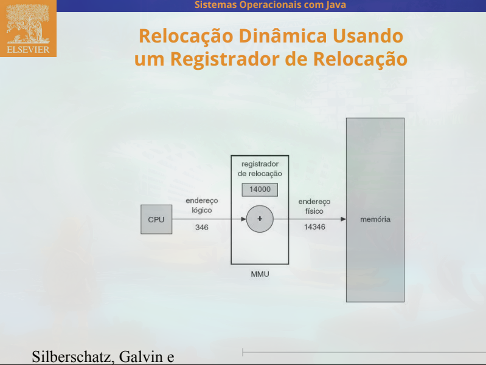
*Figura 1*

A *figura 1* ilustra como a MMU traduz endereços em tempo real passo a passo:

1. A CPU gera um endereço lógico (346). Esse é o endereço que o seu programa ve e com o qual ele trabalha
2. A MMU possui um registrador de relocação que guarda o endereço físico base, ou seja, o local exato onde seu programa foi realmente caarregado na RAM (14000)
3. O hardware da MMU pega o endereço lógico (346) e soma com o valor do registrador de relocação (14000)
4. O resultado dessa soma é o endereço físico real, que é finalmente enviado para a memória RAM para ler ou gravar informação.

### Otimização do Uso do Espaço na Memória

#### Carregamento Dinâmico
A rotina só é carregada na memória física no exato momento em que é chamada. Isso economiza espaço, pois os códigos de erros ou funções raras nunca ocupam a RAM se não forem efetivamente usados, e não exige suporte especial do SO, sendo implementado no projeto do próprio programa.

#### Link Dinâmico
O processo de ligação (link) de bibliotecas é adiado até o tempo de execução. O programa usa um pequeno trecho de código chamado stub para localizar a rotina da biblioteca na memória. Quando chamado, o stub é substituído pelo endereço real da rotina. É a técnica ideal para gerenciar bibliotecas dinâmicas do sistema.

#### Overlay 
Mantém na memória apenas as intruções e os dados estritamente necessários em um determinado passo de execução, permitindo rodar um programa que seja maior que a memória física alocada para ele. Assim como o carregamento dinâmico, não exige suporte do SO e deve ser totalmente implementado pelo programador, o que torna seu desenvolvimento bastante complexo

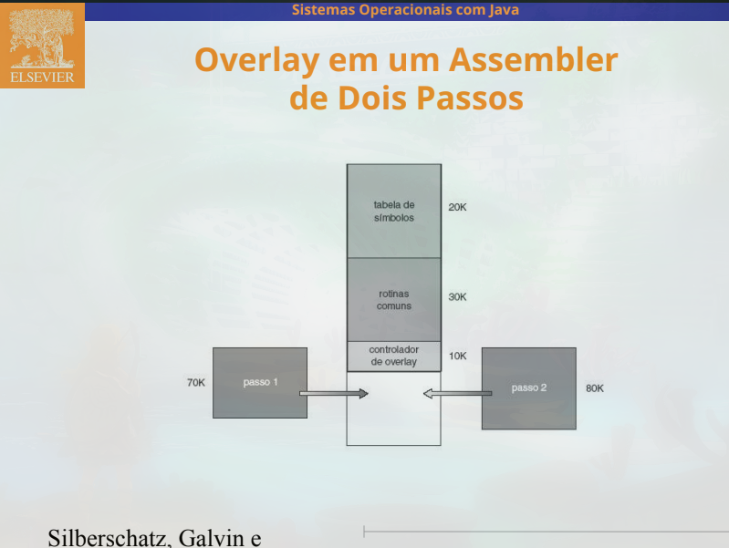
*Figura 2*

A *figura 2* ilustra como rodar um programa q exige mais memória do que o espaço físico alocado para ele.

- Parte fixa (60K): a tabela de símbolos (20K), as rotinas comuns (30K) e o controlador de overlay (10K) precisam permamnecer na memória o tempo todo
- Ovelays (passo 1 e passo 2): o passo 1 (70K) e o passo 2 (80K) são fases distintas do programa que não precisam rodar simultaneamente

A otimização acontece porque o controlador carrega o passo 1 na memória, executa sua tarefa e, ao terminar, substitui pelo passo 2 exatamente no mesmo espaço. Como resultado, em vez do sistema precisar de 210K para carregar todo o código de um,a vez, ele só vai exigir 140K de memória máxima (0s 60K da parte fixa somados aos 80K do maior passo)

### Swapping 
É o mecanismo em que o processo é retirado temporariamente da memória principal e enviado para um armazenamento de apoio (como o disco rígido), em uma ação chamada de *swap up*, para depois ser trazido de volta à memória (*swap in*) e continuar sua execução de onde parou.
A maior parte do tempo de swap é tempo de transferência; o tempo de transferência total é diretamente proporcional à quantidade de memória que sofreu o swap.

- Armazenamento de apoio (Backing store): é o espaço físico no disco que precisa ser rápido e grande o suficiente para acomodar as cópias das imagens de memória de todos os processos, garantindo acesso direto a elas
- Roll out, roll in: é uma variação do swapping utilizada em algoritmos de escalonamento baseados em prioridade. O sistema operacional retira um processo de prioridade menor da memória (*roll out*) para dar espaço a um processo de prioridade mais alta que precisa ser executado (*roll in*)
- Gargalo de desempenho: a maior parte do tempo gasto no processo de swap é puramente tempo de transferência. Esse custo de tempo é diretamente proporcional à quantidade de memória do processo que está sendo tranferida.
- Evolução para paginação: Com a chegada da paginação por demanda, o termo *swap* aplicado ao processo inteiro tornou-se tecnicamente incorreto. Hoje, o sistema usa um "swapper preguiçoso" (chamado de paginador) que não movimenta o processo inteiro para a memória, mas apenas as páginas individuais que são requisistadas.

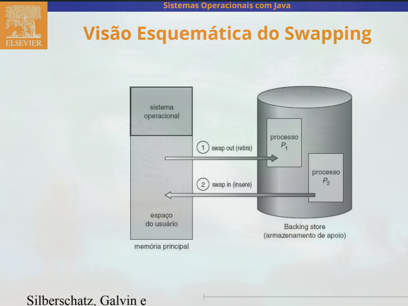
*Figura 3*

A *Figura 3* ilustra o passo a passo da troca física de processos entre a memória principal (RAM) e o disco rígido (armazenamneto de apoio). Ela funciona da seguinte forma:
1. A memória principal aparece dividida em duas áreas: o topo reservado para o sistema operacional e a base para espaço dos usuários
2. Passo 1 (**Swap out - retirar**): O sistema operacional pega um processo que está rodando na RAM (o processo P1) e o copia temporariamente para o disco, liberando espaço físico na memória
3. Passo 2 (**swap in - inserir**): Com o espaço livre, o SO busca no disco o próximo processo que precis utilizar a CPU (proceso P2) e o carrega para a memória principal para ser executado.

Isso permite que o computador mantenha a ilusão de que tem mais memória RAM do que realmente possui, usando o disco como uma grande extensão temporária.

### Alocação Contígua

> A memória normalmente é dividida em duas partições: 
> 1. O sistema operacional residente, em geral mantido na memória com baixo vetor de interrupção
> 2. Processos do usuário, mantidos na memória alta

Na alocação contígua, cada processo deve ocupar um bloco único e contínuo na memória física.

Ele se divide em dois tipos:

1. Partição única: o espaço de memória destinado ao usuário é um bloco só, gerenciado com registradores (de relocação e limite) para proteger o sistema operacional e os processos
2. Multipla partição: a memória possui vários "buracos" (espaços livres) de tamanhos variados espalhados por ela

Quando usamos a múltipla partição, o SO precisa decidir em qual "buraco" colocar um novo processo. Isso gera o problema de alocação de armazenamento dinâmico, que possui três estratégias principais de resolução:
- First-fit: aloca o processo no primeiro buraco que encontrar que tenha tamanho suficiente
- Best-fit: vasculha a lista inteira e aloca o processo no menor buraco possível que seja suficiente, deixando a menor sobra de espaço.
- Worst-fit: aloca o prpocesso no maior buraco disponível, deixando a maior sobra possível

O grande vilão dessa técnica é a fragmentação externa: o espaço total livre na memória pode até ser suficiente para um novo processo, mas como ele está quebrado em vários pequenos buracos não contíguos, a alocação falha. O SO tenta resolver isso com a "compactação" (movendo os processos para juntar os espaços livres), mas isso gasta muito tempo de processamento.

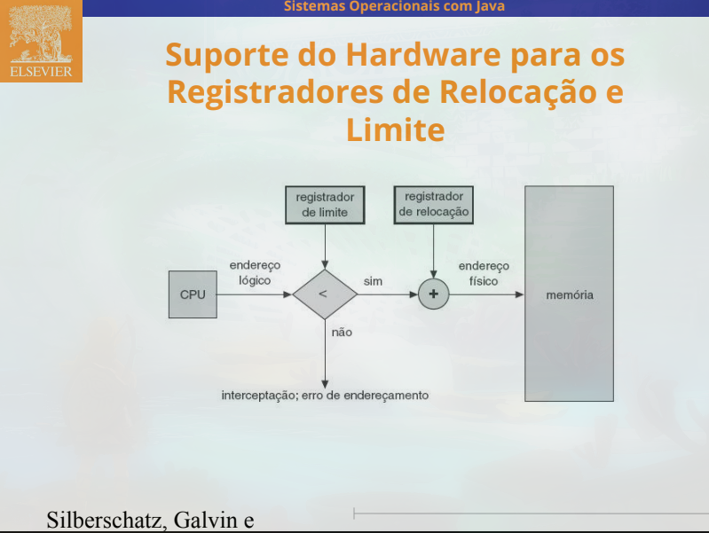
*Figura 4*

A *figura 4* ilustra como o hardware realiza a tradução de endereços ao mesmo tempo em que garante a proteção da memória na alocação contígua. O processo funciona assim:

1. A CPU gera um endereço lógico
2. O hardware primeiro compara esse endereço lógico com o registrador de limite, que define o intervalo dee endereços (o tamanho máximo) permitido apra aquele processo
3. Se o endereço lógico for maior que o limite (caminho "não"), o sistema bloqueia a ação, gerando um erro de interceptação para impedir que o processo acesse a memória de outros usuários ou do próprio SO
4. Se o endereço estiver dentro do limite permitido (caminho "sim"), ele é somado ao valor do registrador de relocação (que guarda o menor endereço físic, ou seja, a base) para finalmente calcular o endereço físico real na memória RAM

Basicamente, o registrador limite funciona como um segurança verificando se você tem permissão pra entrar, enquanto o de relozação atua como guia que te leva até o local exato.

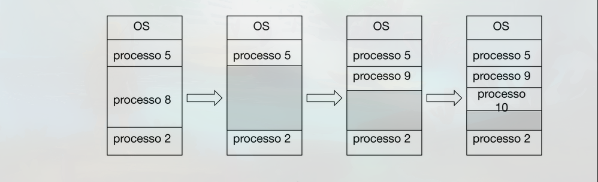
*Figura 5*

A *figura 5* ilustra uma linha do tempo da memória para mostrar como os espaços livres se comportam na alocação de múltipla partição

Ela trata a seguinte sequência de eventos

1. A memóriacomeça cheia com o sistema operacional e três processos (5, 8 e 2)
2. O processo 8 termina a sua execução e sai da memória, deixando no seu lugar um grande espaço vazio (que chamamos de "buraco") entre os processos 5 e 2
3. Quando um novo processo (proceso 9) chega, o SO aproveita esse bruaco grande para acomodá-lo. Como o processo 9 é menor que o espaço total do buraco, ainda sobra um pedaço de memória livre
4. Outro processo (processo 10) chega e é encaixada na próxima parte livre da memória

Essa figura moistra como o constante "entra e sai" de processos de tamanhos variados vai recortando a memória e deixando vários "buracos" espalhados por ela. E é assim que o problema de fragmentação externa se forma.

### Fragmentação

O problema da fragmentação ocorre de duas formas principais:

- Fragmentação externa: acontece quando há espaço de memória total suficnente para satisfazer a uma requisição, mas ele não é contíguo
- Fragmentação interna: ocorre quando a memória alocada pode ser ligeiramente maior do que a memória requisitada. A diferença de tamanho é a memória que é interna a uma partição, mas que não está sendo usada

Para lidar com essa limitação de espaço, o sistema operacional utiliza as seguintes soluções e técnicas:

1. Redução por compactação: o sistema reduz a fragmentação externa por compactação, um processo que reorganiza o conteúdo da memória de modo a coocar toda a memória livre junta em um grande e único bloco. Contrudo, essa téncica tem uma limitação importante: ela é possível apenas se a relocação for dinâmica e feita em tempo de execução
2. Memória virtual: a solução definitiva é o uso da **memória virtua**, uma téncia que permite a execução de processos que podem não estar inteiramente na memória. Isso elimina a obrigatoriedade de ter um bruaco contíguo do tamanho exato do programa. A memória virtual pode ser implementada através de tuas técnicas:
   - Paginação: Garante que o espaço de endereços lógicos de um processo pode ser não contíguo, de forma que um processor recebe memória física onde quer que ela esteja disponível. O sistema divide a memória física em blocos de tamanho fixo, chamados frames, e divide a memória lógica em blocos de mesmo tamanho chamados páginas. (apesar de resolver o problema externo, a paginação causa fragmentação interna)
   - Segmentação: É um esquema de gerenciamento de memória que supota visão da memória pelo usuário, onde um programa é um conjunto de segmentos lógicos. Por alocar espaços de tamanhos variados, a segmentação sofre novamente com a fragmentação exerna.

### Paginação

A paginação é uma técnica de gerenciamento onde o espaço de endereços lógicos de um processo pode não ser contíguo, permitindo que um processo receba memória física onde quer que ela esteja disponível.

Para que isso funcione, o sistema faz o seguinte:

- divide a memória física em blocos de tamanho fixo chamados frames (o tamanho é potencia de 2, entre 512 e 8192 bytes)
- divide a memória lógica (do programa) em blocos de mesmo tamanho chamados páginas.
- utiliza uma tabela de página para fazer a tradução dos endereços lógicos para os endereços físicos

> para executar um programa de n páginas, é necessário encontrar n frames disponíveis e carregar o programa

A grande vantagem é resolver a fragmentação externa, mas o seu principal problema é que ela gera fragmentação interna. 

#### Esquema de Tradução de Endereço

No esquema de tradução, o endereço lógico gerado pela CPU é divido em duas partes:

- Número de página (p): é usado como um índice para buscar na "tabela de página" o endereço de base de cada página na memória física.
- Deslocamento de página (d): é combinado com esse endereço de base para definir o endereço físico final que será enviado para a unidade de memória.

O grande problema desse esquema básico é que, como a tabela fica na memória principal, cada instrução exigiria dois acessos à memória (um para a tabela e outro para o dado), o que deixa o sistema lento.

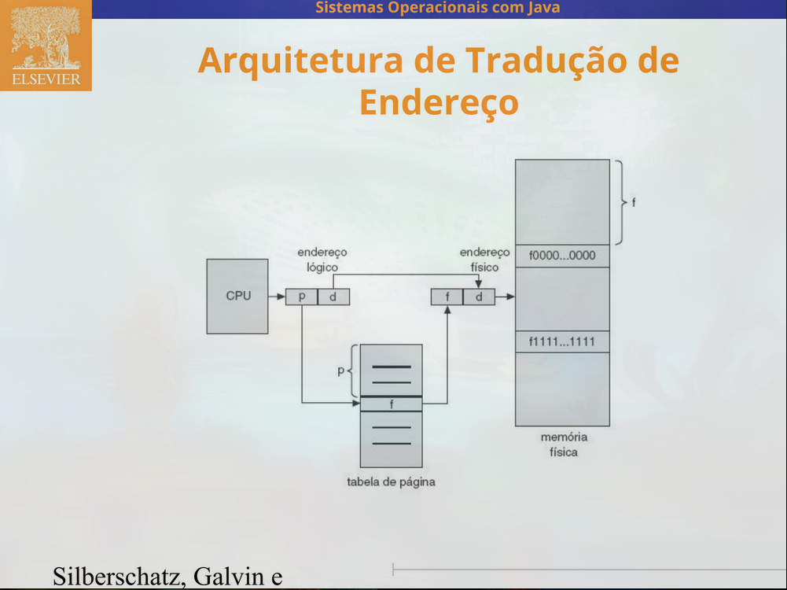
*Figura 8*

A *figura 8* ilustra o passo a passo de como o hardware converte um endereço virtual em um endereço real na memória 

1. A CPU gera um endereço lógico que é dividido em duas partes: o número de página (p) e o deslocamento de página (d)
2. O valor p funciona como um índice para realizar uma busca na  tabela de página
3. Dentro dessa tabela, o sistema encontra o valor f, que é o endereço de base do quadro (frame) na memória física onde aquela página foi realmente guardada
4. O hardware então combina esse endereço de base (f) com o deslocamento original (d)
5. Essa união forma o endereço físico final, que é enviado à unidade de memória para acessar o dado exato na memória física.

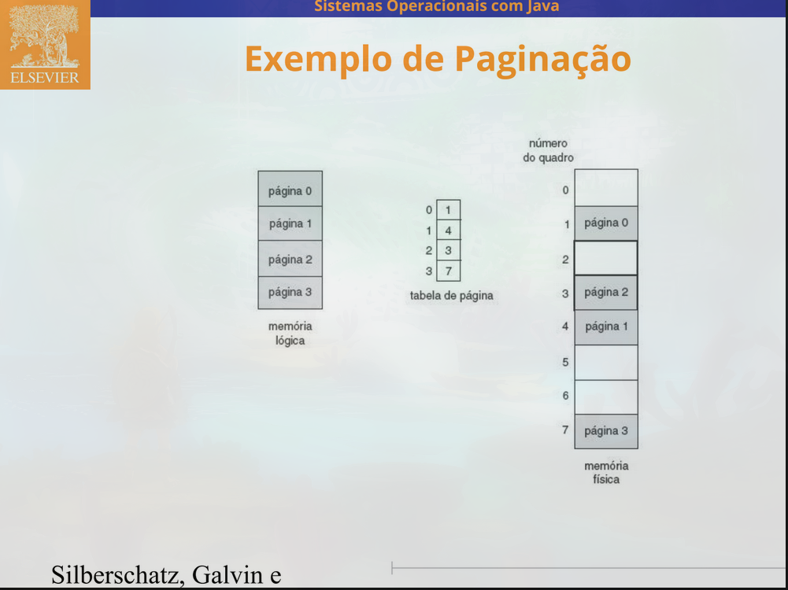
*Figura 9*

A *Figura 9* ilustra o princípio visual básico de como os blocos dos programas são espalhados.

- Na **memória lógica**, o processo do usuário é visto como um bloco contínuo, dividido ordenadamente em quatro partes (página 0, página 1, página 2 e página 3)
- A **tabela de página** atua como o mapa de tradução. Ela indica exatamente em qual número do quadro (frame) cada uma dessas páginas foi parar
- Na **memória física**, o resultado prático aparece: as páginas estão totalmente misturadas e em espaços não contíguos. A página 0 foi guardada no quadro 1, a paǵina 1 no quadro 4, a página 2 no quadro 3, e a página 3 no quadro 7.

*Figura 10*

A *figura 10* aprofunda esse mesmo exemplo da *figura 9*, mas agora mostrando o conteúdo interno das páginas e os endereços matemáticos exatos.

- A **memória lógica** possui 16 itens reais (representados pelas letras de a até p). Eles estão divididos em páginas que comportam 4 itens cada (pore exemplo, a página 0 contém as letras a, b c, d e a página 2 contém i, j, k, l)
- A **tabela de página** dita que a página 0 vai para o quadro 5, e a página 2 vai para o quadro 1
- Na **memória física**, vemos que os quadros respeitam ecatamente o mesmo tamanho das páginas (4 itens de espaço). As letras a, b, c, d foram armazenadas juntas a partir do endereço físico 20 (que é o início do quadro 5), enquanto as letras i, j, k, l foram guardadas a partir do endereço físico 4 (o iníciondo quadro 1)

Ambas as imagens provam a grande vantagem teórica da paginação: o programa acha que está em um espaço perfeito e ordenado, mas na realidade ele recebe memória física onde quer que ela esteja disponível.

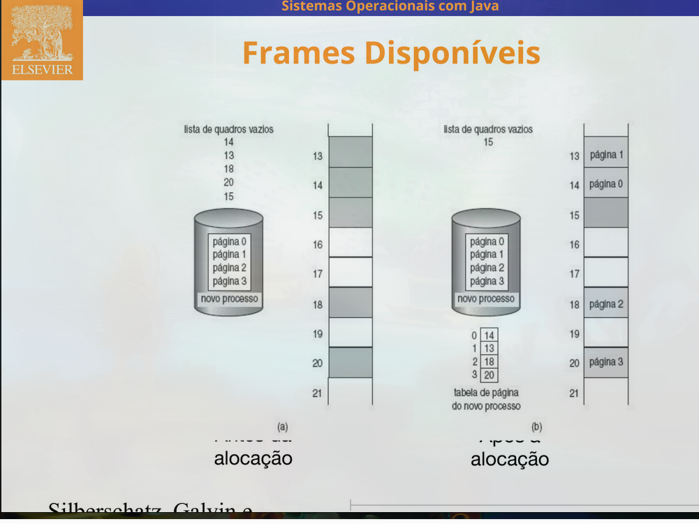
*Figura 11*

A *figura 11* ilustra na prática o antes e depois de um processo ser carregado na memória.

Ela se divide em dois momentos:

- Antes da alocação: Existe um "novo processo" aguardando no disco, dividido em 4 páginas (de 0 a 3). o sistema possui uma lista de quadros vazios que indica exatamente quais frames estão livres na memória física naquele momento (14, 13, 18, 20, 15)
- Após a alocação: o sistema pega as 4 páginas do processo e as espalha nesses quadros livres disponíveis. A lista de quadros vazios é atualizada e passa a ter apenas o frame 15 sobrando

Para não se perder, o sistema cria a tabela de página do novo processo, anotando como ficou o mapeamento (ex: a página 0 foi guardada no frame 14, a página 1 no frame 13, a página 2 no frame 18 e a página 3 o frame 20).

#### Implementação da Tabela de Página

Na implementação clássica, a tabela de página é mantida diretamente na memória principal. Para gerenciar isso, o hardware utiliza dois registradores específicos:

- PTBR (registrador de base da tabela de página): atua como um ponteiro que indica o local exato onde a tabela começa na memória
- PRLR (Registrador de extensão da tabela de página): informa qual é o tamanho total dessa tabela

O grande problema dessa abordagem é o desempenho: como a tabela está na RAM, cada instrução executada pela CPU exige dois acessos à memória (o primeiro para consultar a tabela de página e descobrir o endereço, eo segundo para acessar o dado real). Isso reduz a velocidade do sistema pela metade.

Para resolver esse gargalo dos dois acessos, a arquitetura adiciona um cache de hardware especial e ultrarrápido chamado memória associativa ou TLB (translation look-aside buffers)

####  TLB (translation look-aside buffers)

O TLB é um cache de hardware especial de pesquisa rápida. A sua principal característica é realidar uma pesquisa paralela na tabela. Ela serve para resolver o problema de lentidão da paginação, evitando que a CPU precise fazer dois acessos à memória (um na tabela de página e outro no dado real) para executar cada instrução

Na prática, ela guarda as traduções de endereços mais recentes para que a CPU ache o local físico da página quase istantaneamente.

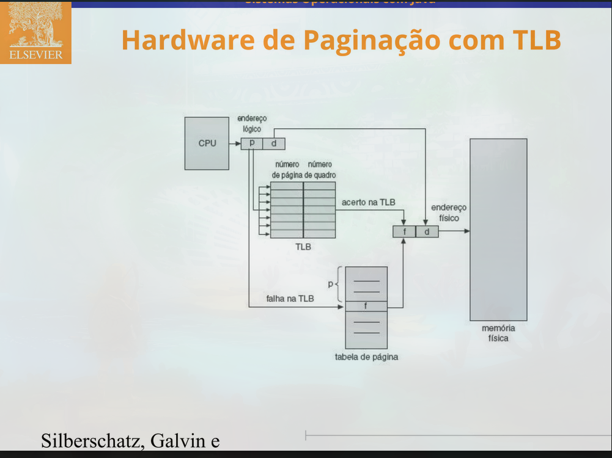
*Figura 12*

A *figura 12* ilustra o fluxo para acelerar a tradução do endereço lógico. Funciona da seguinte forma:

1. A CPU gera um endereço lógico dividido em números de página (p) e deslocamento (d)
2. O sistema faz uma pesquisa rápidad buscando o valor p na TLB
3. Se a página for encontrada, ocorre um acerto na TLB. O hardware obtém o número de quadro (f) instantaneamente, combina com o deslocamento (d) para criar o endereço físico e acessa a memória física.
4. Se a página não for encontrada, ocorre uma falha na TLB. O sistema é pbrigado a consultar a lenta tabela de página na memória principal para encontrar a relação entre a página (p) e o quadro (f). Feito isso, ele forma o endereço físico e atualiza a TLB para consultas futuras.

Com esse acerto, o sistema evita gargalo de fazer dois acessos lentos na memória.

#### Estrutura da tabela de página

##### Paginação Hierárquica

A paginação hierárquica é uma técnica criada para organizar tabelas de página
que ficam grandes demais. Em vez de usar uma tabela única e contínua, o sistema
divide o espaço de endereços lógicos em várias tabelas de página.

A forma mais simples e comum de fazer isso é utilizando uma tabela de página de
dois níveis. Na prática, isso significa que a própria tabela de página também é
paginada. Para que isso funcione, o endereço lógico gerado pela CPU é dividido
em três partes:

- *p1*: funciona como um índice para buscar a tabela de página mais externa
- *p2*: funciona como um índice secundário (deslocamento) para buscar o quadro
  na tabela de página interna
- *d*: é o deslocamento final para encontrar o dado exato dentro da página real

##### Tabela de página ivnertida
A tabela de página invertida muda a lógica do mapeamento: em vez de ter uma
entrada para cada página do programa, ela possui uma entrada para cada página
real (física) da memória.

Cada entrada guarda o endereço virtual da página e as informações de qual
processo é o dono dela.

Isso traz uma grande vantagem de espaço, pois diminui a quantidade de memória
necessária para armazenar a tabela. Porém, a desvantagem é que isso aumenta o
tempo necessário para procurar uma página. Para resolver essa lentidão, a
arquitetura utiliza uma tabela de hash, que agiliza o processo limitado a
pesquisa a apenas umas ou poucas entradas.

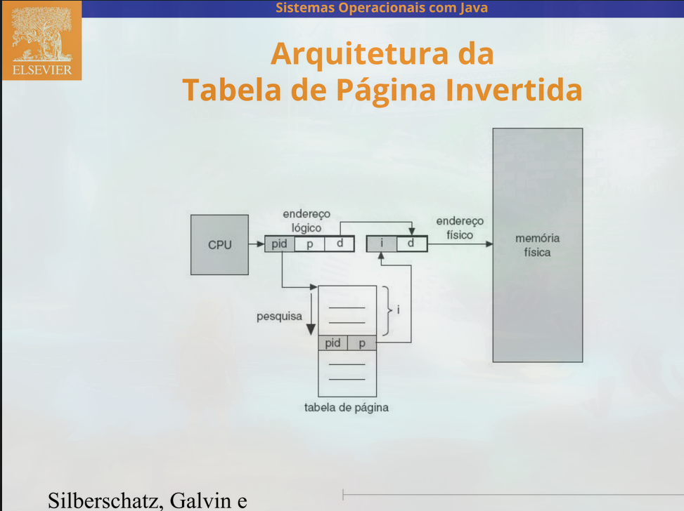
*Figura 18*

A *figura 17* mostra o passo a passo de como o endereço é formado quando o mapa
é baseado na memória física real.

FUnciona da seguinte forma:
1. A CPU gera um ednereço lógico contendo três partes: o identificador do
   processo (pid), o número da página virtual (p) e o delocamento (d)
2. O hardware realiza uma pesquisa descendo pela tabela de página até encontrar
   a entrada que contenha exatamente a mesma combinação de pid e p.
3. A posição exata (o índice da linha) onde essa combinação foi achada é
   representada pela letra i. Esse índice é o próprio número do quadro na
   memória real.
4. O endereço físico éconstruído juntando esse índice i com o deslocamento
   original d, acessando o dado na memória física.

Isso iluistra visualemtne por que o processo é mais lento e exige a tabela de
hash para pular direto para a linha certa.

### Segmentação
A segmentação é um esquema de gerenciamento que divide a memória baseando-se na
visão lógica que o próprio usuário e o programador tem do programa.

Diferente da paginação, que quebra o espaço "cegamente" em pedaços de tamanho
fixo, a segmentação entende que um programa é um conjunto de segmentos de
tamanhos variados. Cada segmento representa uma unidaded lógica com um propósito
específico no código, como o programa principal, procedimentos, funções, pilhas,
objetos ou matrizes.

Na prática, isso muda a forma de acessar os dados. O endereço lógico gerado pela
CPU passa a consistir em uma tupla com duas partes: o número do segmento e o
deslocamento.

O grande desafio dessa técnica é a alocação de armazenamento dinâmico: como os
segmentos tem extensões diferentes, o sistema precisa usar algoritmos como o
first-fit ou best-fit para tentar encaixá-los nos "buracos" livres, o que traz
de volta o problema da fragmentação externa.

Para mapear onde cada pedaço de tamanho variável foi parar na memória física
real, o hardware utiliza uma "tabela de segmentos".

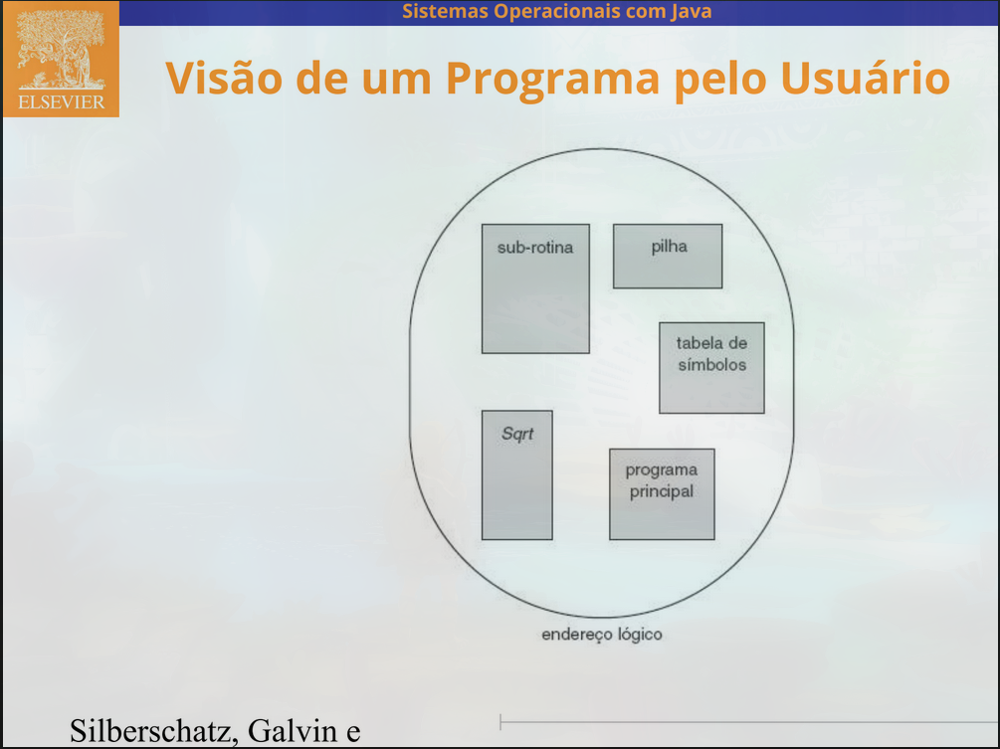
*Figura 19*

A *figura 19* mostra que, na cabeça do programador, o software não é um bloco
contínuo de dados. Ele é visto como um conjunto de módulos independentes e de
tamanhos variados, onde cada parte representa uma unidade lógica.

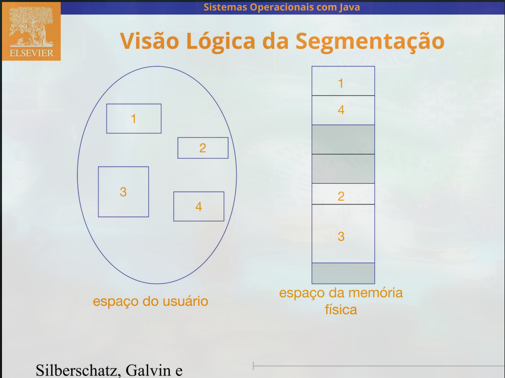
*Figura 20*

A *figura 20* mostra o que o sistema faz com esses pedaços. No espaço do
usuário, vemos os segmentos separados e numerados. Ao passatem para o espaço da
memória física, o sistema pega cada um desses segmentos com seus tamanhos
originais e os guarda espalhados na memória real, preenchendo os espaços livres
que encontra. Como os espaços ficam todos espalhados e tem tamanhos diferentes,
o hardware precisa de um mapa exato para não perder nada.

#### Arquitetura da Segmentação
Na arquitetura da segmentação, o endereço lógico gerado pela CPU não é um número
único, mas sim uma tupla dividida em duas partes: o número de segmentos (s) e o
deslocamento (d).

O sistema usa o número do segmento (s) para buscar as coordenadas exatas na
tabela de segmentos. Cada entradda nessa tabela contém dois valores essenciais
para a tradução:

- Base: indica o endereço físico inicial onde o segmento foi de fato guardado na
  memória RAM.
- limite: especifica o tamanho (a extensão) desse segmento

Quando a CPU pede um dado, o hardware atua como um seguranç: ele compara o
deslocamento (d) exigido com o valor limite do segmento. Se o deslocamento for
válido (menor que o limite), ele o soma com a base para chegar ao endereço
físico real e acessar o dado. Se o porgrama tentar acessar um espaço fora do
limite, o sistema acusa um erro de endereçamento e aborta a operação.

para não se perder, o hardware se apoia em dois registradores: o STBR, que
aponta onde essa tabela de segmentos está guardada na memória principal, e o
STLR, que sabe exatamente quantos segmentos aquele programa possui.

Como a segmentação entende a divisão lógica do código, ela facilita muito a
proteção e o compartilhamento de pedaços específicos do programa (como códigos
de um editor de texto) entre vários usuários.

A relocação é dinâmica porque o endereço físico exato só é calculado na hora da
execução, através da consulta à tabela de segmentos.

como os pedaços do código tem tamanhos variados, o sistema enfrente o problema
de alocação de armazenamento dinâmico. Ele é obrigado a usar algoritmos como o
first-fit ou best-fit para encaixar os segmentos nos "buracos" livres na
memória, o que inevitavelmente causa a fragmentação externa,.

Para garantir a proteção, a tabela de segmentos adiciona um bit de validação
(onde 0 avisa que o acesso ao segmento é inválido) e define privilégios claros
de leitura ou gravação para cada pedaçao. 

Essa estrutura facilita o compartilhamento: como a proteção é controlada
diretamente no nível do segmento, o sistema permite que dois processos
diferentes compartilhem um mesmo código na memória, bastanto que ambos utilizem
o mesmo número de segmento.

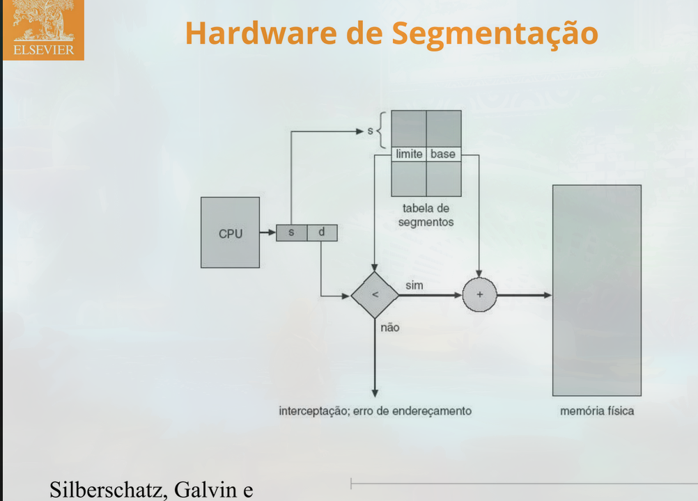
*Figura 21*

A *figura 21* ilustra o fluxo de tradução de endereço acoplado a um mecanismo de
segurança. O processo ocorre da seguinte forma:

1. A CPU gera um endereço lógico dividido em duas aprtes: o número do segmento
   (s) e o deslocamento (d)
2. O hardware usa o valor s para buscar na tabela de segmentos as duas
   informações vitais: o limite (tamanho total) e a base (endereço físico
   inicial) daquele segmento
3. Em seguida, ocorre o teste de proteção (representado pelo losango): o
   hardware compara se o deslocamento d que o programa quer acessar é menor que
   o limite do segmento.
4. Se o limite for ultrapassado (caminho do não), o sistema acusa interceptação
   por erro de endereçamento e aborta a operação, protegendo a memória
5. se for um pedido válido, o valor de d é levado ao somador e adicionado ao
   valor da base. O resultado dessa soma é o endereço físico final que vai de
   fato acessar o dado na memória física.

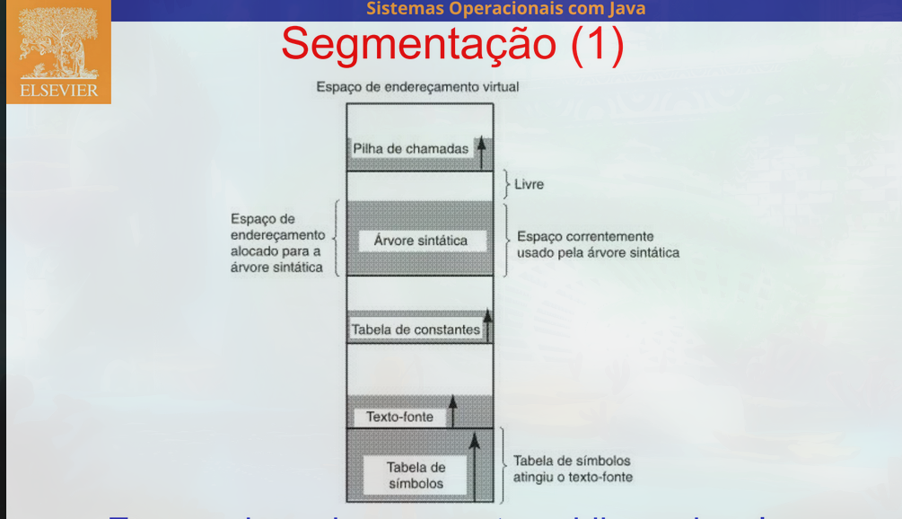
*Figura 22*

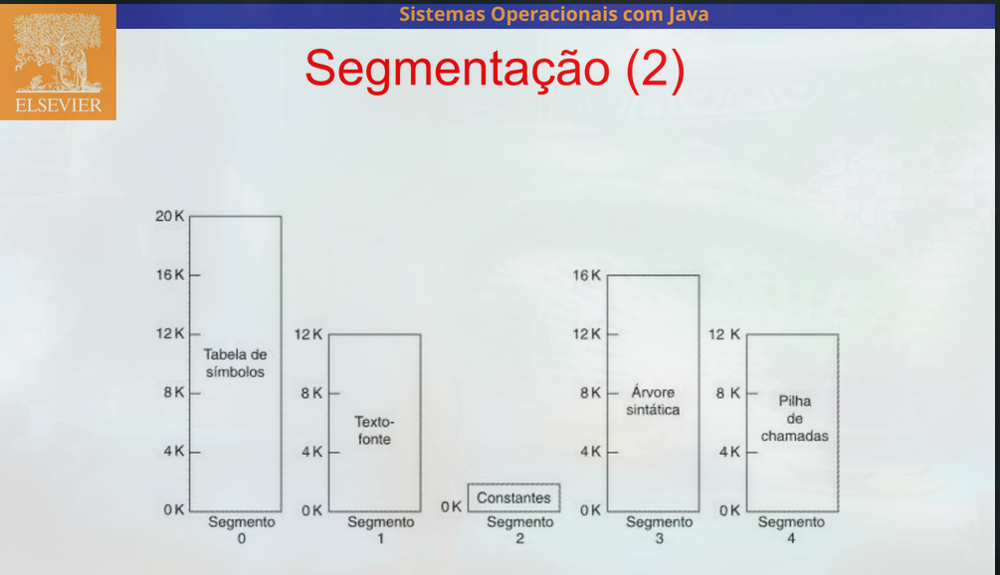
*Figura 23*

A *figura 22* mostra o problema clássico de uma memória linear onde tabelas
crescem até "baterem" umas nas outras. A *figura 23* prova que a segmentação
resolve isso isolando os pedaços, permitindo qaue eles cresçam ou encolham de
forma totalmente independente no espaço virtual.

*Figura 24*

*Figura 25*

*Figura 26*

As *figuras 24-26* mostram o modelo híbrido definitivo. Em vez de um segmento
apontar direto para os dados na memória, os descritores de segmento apontam para
tabelas de páginas. O endereço é dividido em três partes (número do segmento,
número da página e deslocamento). Isso une a organização lógica da segmentação
com o fim da fragmentação externa porporcionado pela paginação.

---

## 2. Memória Virtual

A memória virtual é uma ténica que permite a execução de processos que podem não estar inteiramente na memória. O seu requisito básico é que as intruções sendo executadas precisam estar na memória física.

As principais vantagens são:

- programas podem ser maiores do que a memória física
- abstrai memória principal em um vetor extremamente grande e uniforme de armazenamento, searando a memória lógica (vista pelo usuário) da memória física
- apenas parte do programa precisa estar na memória para a execução
- o espaço de endereçametno lógico pode, então ser muito maior que o espaço de endereçamento físico.
- permite que os espaços de endereçamento sejam compartilhados por vários processos.
- favorece uma criação de processos masi eficiente
- como cada programa de usuário pode utilizar menos memória física, mais programas poderiam ser executados ao mesmo tempo
- menos operações de I/O seriam necessárias para carregar ou fazer a movimentação de programas de usuário para a memória

Para funcionar na prática, o sistema precisa implementar essa técnica através de paginação por demanda ou segmentação por demanda.

*Figura 6*

A *figura 6* ilustra de forma prática como a memória virtual permite executar um programa que é maior do que a RAM disponível.

Nela,vemos a memória virtual (espaço lógico dividido em páginas) representada como um bloco muito maior que a memória física. O processo funciona através de um mapa de memória posicionado no meio, que faz a tradução entre esses dois espaços.

As setas apontando da memória fisica para o cilindro (disco) mostram o segredo da ténica: como o programa inteiro não cabe na RAM, apenas algumas partes ficam na memória física, enquanto o restante aguarda no disco e é transferido apenas quando é necessário.

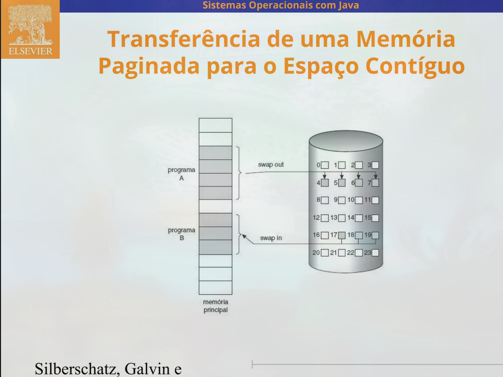
*Figura 7*

A *figura 7* ilustra como o sistema moviemnta os dados entre a memória principal e o disco quando a memória está paginada.

Ela destaca os seguintes passos:

1. na **memória principal**, as páginas do "programa A" e do "programa B" estão espalhadas em espaços não contíguos (separados)
2. Quando o ssitema faz o swap out (retira o rpocesso), ele junta essas páginas espalhadas e as grava agrupadas em um espaço contíguo no disco (representado pelo cilindro)
3. Quando faz o swap in (insere o processo), ele lê o bloco contíguo do "programa B" que estava no disco e o carrega de volta para os espaços livres da memória principal, espalhando as páginas novamente.

Gravar os dados de forma contígua no disco otimiza muito o tempo de trasnferência

### Paginação por Demanda

É a técnica que traz uma página para a memória apenas quando é necessária.

Em vez de movimentar todo o processo para a memória de uma vez, o sistema usa um swapper "preguiçoso", que passa a ser chamado de paginador. Esse paginador nunca carrega uma página a menos que o programa faça uma "referência a ela". Se a página referenciada não estiver na memória, o paginador a traz do disco; se a referência for inválida, a operação aborta.

Isso traz vantagens como:
- menor necessidade de E/S, 
- menos memória necessária,
- reposta mais rápida 
- permite ter mais usuários no sistema simultaneamente.

Desafios:
- Se todos os processos tentarem usar todas as suas páginas ao mesmo tempo, pode faltar espaços, criando a necessidade de modificar a rotina de falha de página para incluir a substituição

Se a memória encher de tanto trazer novas páginas, o sistema precisará acionar a **substituição de página** para abrir espaço.

> O paginador adivinha que páginas serão usadas antes que o processo seja descarregado novamente. Isso faz com que seja evitado a leitura de páginas de memória que não serão utilizadas, diminuindo o tempo de troca e a quantidade de memória física necessária.

> Bit válido (V): Significa que está tudo certo. A página soliticada pertence ao programa e já está carregada na memória física. Nesse cenário, o processo lê os dados rapidamente e a execução continua normal e sem pausas.

> Bit Inválido (i): Significa um alerta que pode ter dois motivos, ou o programa tentou acessar um endereço ilegal que não é dele, ou a página é legal, mas o paginador ainda dedixou guardada no disco

*Figura 13*

A *figura 13* ilustra na prática como a tabela utiliza o bit válido/inválido para gerenciar o que está ou não carregado no sistema no momento de execução.

Ela se divide nas seguintes partes principais:

1. Memória lógica: mostra o processo do usuário de forma contínua, dividindo em 8 páginas (representadas pelas letras A  até H)
2. Tabela de página: atua como o mapa de controle. Note que apenas as páginas A, C e F possuem um quadro (frame) associado e o bit marcado como v (válido). As demais páginas (B, D, E, G, H) estão marcadas com o bit i (inválido).
3. Memória física e armazenamento de apoio: aqui vemos o resultado físico da abela. As páginas válidas (A, C, F) estão carregadas nos quadros 4, 6 e 9 da memória física. As páginas inválidas não sumiram; o desenho mostra que elas estão apenas guardadas no cilindro, que representa o armazenamento de apoio.

Como foi visto anteriormente, se o programa tentar ler a página "B", ele vai esbarrar no bit "i", o que causa a interrupção de falha de página para forçar o sistema a buscar essa página no cilindro. 

> A falha de página (page-faulty trap) ocorre quando um processo tetna usar uma página que pertence a ele, mas que ainda não foi carregada na memória e está marcada com o bit inválido.

*Figura 14*

A *figura 14* ilustra o passo a passo exato de como o sistema operacional pausa o programa e resolve esse problema de falha de página:

1. A CPU faz a referência à página na tabela e encontra o bit inválido (i)
2. O hradware gera uma **interceptação (trap)** avisando o SO sobre a falta
3. O SO procura onde essa página está guardada no armazenamento de apoio (disco)
4. O SO **traz a página ausente** (faz o strap-in) e a coloca em um **quadro livre** na memória física
5. O SO **reinicia a tabela de página**, alterando o bit de validação para 1 (válido)
6. O SO **reinicia a instrução**, permitindo que o programa tente ler a página novamente e continue exatamente de onde parou.

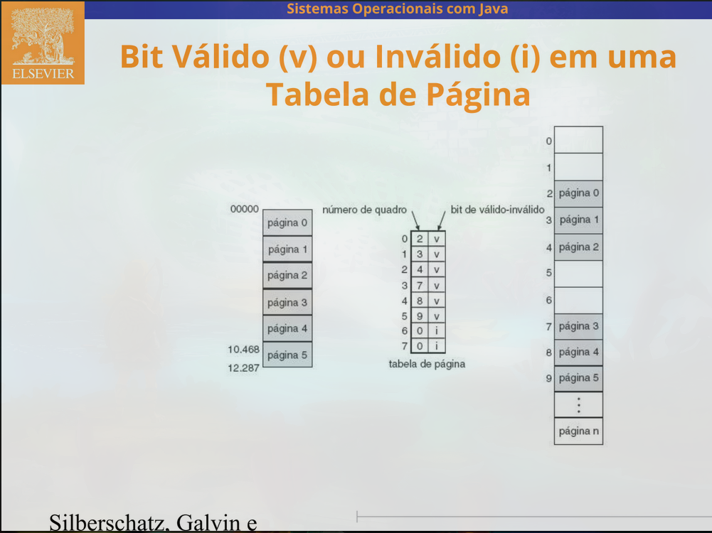
*Figura 15*

A *figura 15* ilustra um "instantâneo de taela de página" trabalhando na prática para controlar o que está ou não disónível para o procecsso.

Ela é dividida em três blocos que mostram essa relação:

1. As páginas do processo: à esquerda, vemos o programa dividido da página 0 até a página n
2. A tabela de página: no centro, a tabela aponta o número de quadro de cada página e seu respectivo bit de válido-inválido. As paǵinas de 0 a 5 receberam um quadro físico e o bit v, confirmando que estão na memória.Já as entradas 6 e 7 estão com o bit i, indicando que não estão validadas.
3. A memória física: á direita, vemos o resultado real das páginas válidas alocadas nos quadros exatos descritos pela tabela (quadros 2, 3, 4, 7, 8 e 9)

Como já foi visto, durante a tradução do endereço, se um bit válido-inválido na entrada da tabela da página for 0 (ou seja, i), o sistema aciona a "falha de página" para ir buscar esse dado no disco.

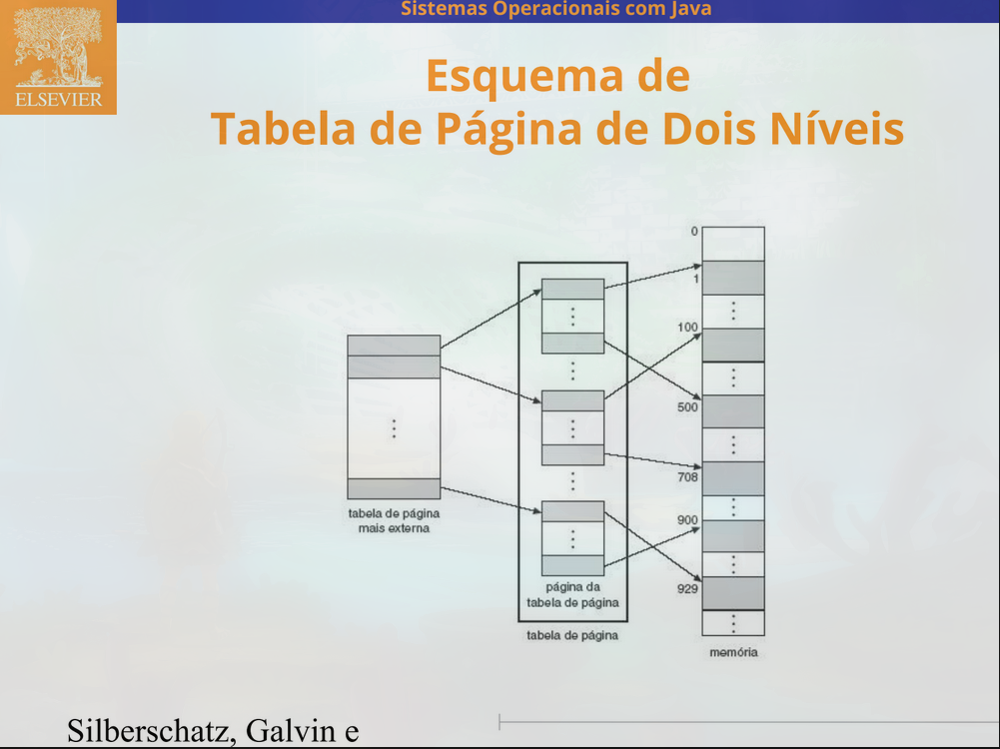
*Figura 16*

A *figura 16* mostra a organização física dessa hierarquia. Nela, você vê  uma
tabela de página masi externa que atua como índice principal. As entradas dessa
tabela não apontam diretamente para os dados, mas sim para partes menores
chamadas páginas da tabela de página (tabelas secundárias), que então apontam
para os endereços finais na "memória" física.

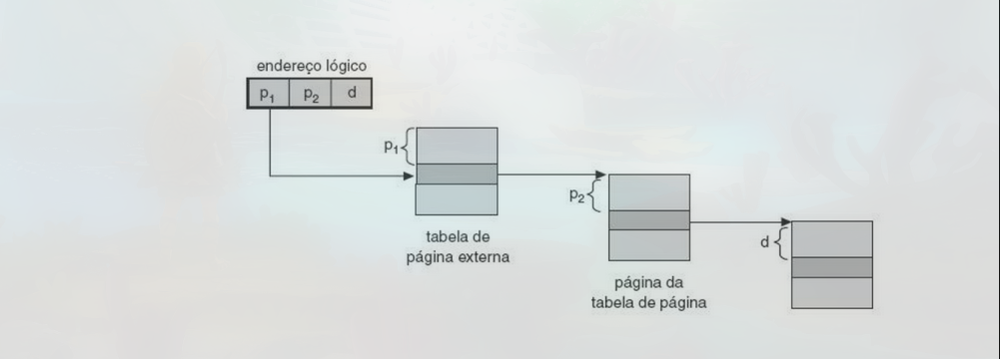
*Figura 17*

A *figura 17* mostra o caminho passo a passo que o hardware faz para acessar o
dado. Ele funciona da seguinte forma:

1. O hardware usa o índice *p1* na tabela mais externa para descobrir qual é a
   tabela decundária correta
2. Depois, ele usa o índice *p2* dentro dessa tabela secundária para finalmente
   encotnrar o quadro físico
3. O deslocamento final *d* se junta a esse quadro para acessar o dado exato

### Substituição de Página
A substituição de página é a solução do sistema operacional para quando a
memória física (RAM) fica completamente cheia (um problema chamado superalocação)

Na prátia, se um processo pedir uma página nova e não houver mais nenhum quadro (frame) livre na memória, o sistema procura uma página que já estava lá, mas não está sendo usada no momento, e a "expulsa" de volta para o disco (área de swap). Isso libera o espaço necessário para trazer a página que o programa acabou dee pedir.

É exatamente graças a essa técnica que a memória virtual funciona, permitindo
que você tode programas muito maiores do que a memória física que seu computador
possui. 

A sobrelocação ocorre quando a demanda total por memória dos programas e execução ultrapassa o espaço físico real disponível na RAM.

Como a paginação por demanda só carrega partes do código na hora em que são
necessárias, o sistema se sente "confiante" para iniciar mais programas ao mesmo tempo. Por exemplo, se a RAM tem apenas 40 quadros (frames) livres, o sistema pode rodar 8 processos que possuem 10 páginas cada.

O problema "estoura" se, em determinado momento, todos esses 8 processos precisarem usar todas as suas 10 páginas simultaneamente. O sistema exigirá 80 quadros, mas só tem os 40 físicos. Quando ocorre uma falha de página e o sistema operacional vai buscar o dado no disco, ele percebe que a lsita de quadros livres está zerada.

Para não travar ou fechar os programas do usuário, o sistema é obrigado a
realizar a ssubstituição de pagina, expulsando aguém da memórai para abrir
espaço. 

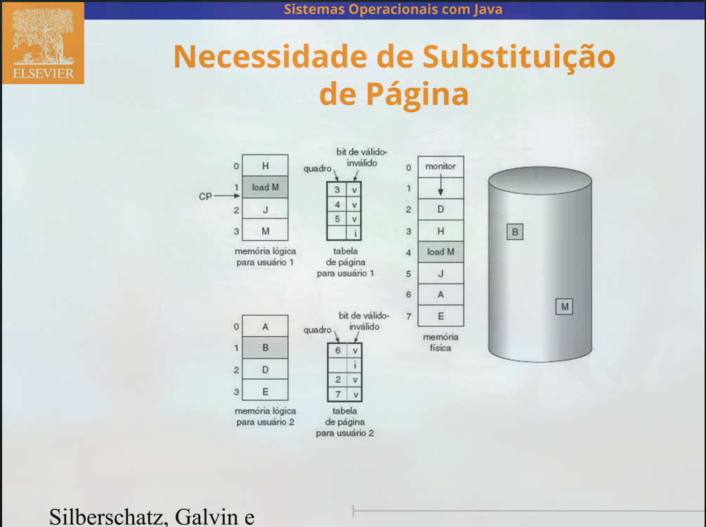
*Figura 27*

A *figura 27* ilustra visualmente o exato momento em que a sobrealocação se
torna um problema.

Ele detalha o seguinte cenário:

1. A divisão do sistema: A imagem mostra dois programas rodando ao mesmo tempo (usuário 1 e usuário 2), cada um com sua própria memória lógica e sua respectiva tabela de página
2. O processo do usuário 1 está sendo executado e a CPU chega na instrução load
   M. O hardware consulta a tabela de página desse usuário e percebe que o dado "M" está marcado com o bit inválido, indicando que ele está guardado no disco
3. O gargalo: O sistema operacional aciona a falha de página e vai até o disco
   buscar o M. No entanto, ao observar o bloco da memória física, nota-se que
   todos os quadros já estão completamente ocupados por outras partes dos
   programas.

Como não á mais nenhum espaço livre sobrando, o sistema se depara exatamente com
a necessidadee de substituição: para que a página "M" possa entrar na memória física e o programa continuar rodando, o SO será obrigado a escolher uma das páginas que já estão lá dentro como vítima e expulsá-la de volta para o disco.

#### Algoritmos de Substituição de Página

O grande objetivo de qualquer algoritmo de substituição é fazer a escolha da
página "vítima" da forma mais inteligente possível, garantindo a menor taxa de falhas de páginas durante a execução.

##### FIFO - First in First out

O algoritmo FIFO funciona registrando a ordem de chegada das páginas,
basicamente organizando tudo em uma fila. Quando a memória enche e o sistema
precisa abrir espaço, ele é direto: sempre escolhe a página mais antiga para ser
expulsa.

Apesar de muito simples, o desempenho do FIFO nem sempre é bom. O grande
problema prático é que a página mais velha do sistema podee conter variáveis
fundamentais que foram carregadas no início, mas que continuam em uso constante
pelo programa. Se o sistema expulsar essa página ativa, o pograma vai
solicitá-la de novo quase imediatamente, gerando uma nova falha de página.

Além da ineficiência em prever que o programa está usando, o FIFO sofre de um
fenômeno chamado anomalia de beladay. 

A anomalia de beladay é um fenomeno onde adicionar mais memórias física
(quaddros livres) acaba
causando mais falhas de páginas, em vez de menos.

Normalmente, espera-se que ao dar mais espaço a um programa, o desempenho
melhore, No entanto, como o FIFO apenas expulsa a página que chegou primeiro,
independentemente de ela ser muito usada no momento, alterar o tamanho da fila
pode mudar a ordem das trocas de um jeito que prejudica a execução e gera mais
lentidão.

##### Algoritmo Ótimo

O algoritmo ótimo possui a menor taxa de falhas de página possível para um
número fixo de quadros. Ele funciona substituindo sempre a página que vai
demorar mais tempo pra ser usada no futuro.

O grande problema é que ele exige "prever o futuro". Como o sistema operacional
não tem como saber antecipadamente quais páginas o programa vai solicitar
depois, esse algoritmo é inviável de ser implementado na prática. Na vida real,
ele serve apenas como uma base de comparação para avaliar a eficiência de outros
algorirtmos.

##### LRU - Least Recently Used

O algoritmo LRU resolve o problema de prever o futuro. Ele escolhe para ser
expulso a página que não foi usada pelo maior período de tempo.

Para isso funcionar, o sistema precisa associar a cada página a data em que ela
foi acessada pela última vez. Como manter essa ordem atualizada a cada instrução
é um desafio pesado para o sistema, o hardware geralmente implementa isso de
duas formas:

- Contadores: adiciona um relógio lógico em cada entrada da tabela. Quando o
  sistema precisa expulsar alguém, ele olha os contadores para achar a página
  mais antiga
- Pilha: mantém uma lista onde a página que acabou de ser usada é sempre movida
  para o topo, garantindo que as páginas esquewcidas fiquem naturalmente no
  fundo da pilha

### Alocação de Frames

A alocação de frames é o mecanismo que o sistema operacional usa para decidir
como dividir a quantidade fixa de memória livre entre os vários processos que
estão em execução.

Para fazer essa divisão na prática, o sistema pode usar diferentes abordagens:

- Alocação fixa: Divide o total de quadros de forma exata. Por exemplo, se há
  100 quadros e 5 processos, cada um recebe 20 quadros.
- Alocação por prioridade: Entrega uma quantidade maior de quadros para
  processos que ocupam masi espaço físico ou que possuem prioridade mais alta no
  sistema.

Essa alocação dita a regra do jogo na hora em que a memória enche e o sistema
precisa expulsar alguém. Ele faz isso através de duas estratégias:

- Substituição Global: O processo tem a liberdado de selecionar e "roubar" um
  quadro de qualquer lugar da memória, tirando o espaço de outros processos
- Substituição Local: O processo é restrito e só pode escolher uma página vítima
  de dentro do seu próprio conjunto de quadros que lhe foi alocado
